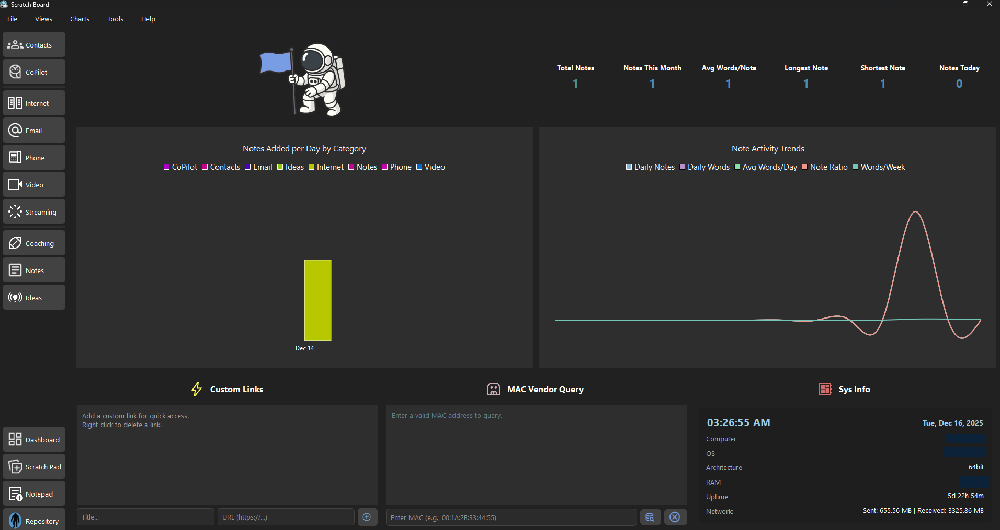
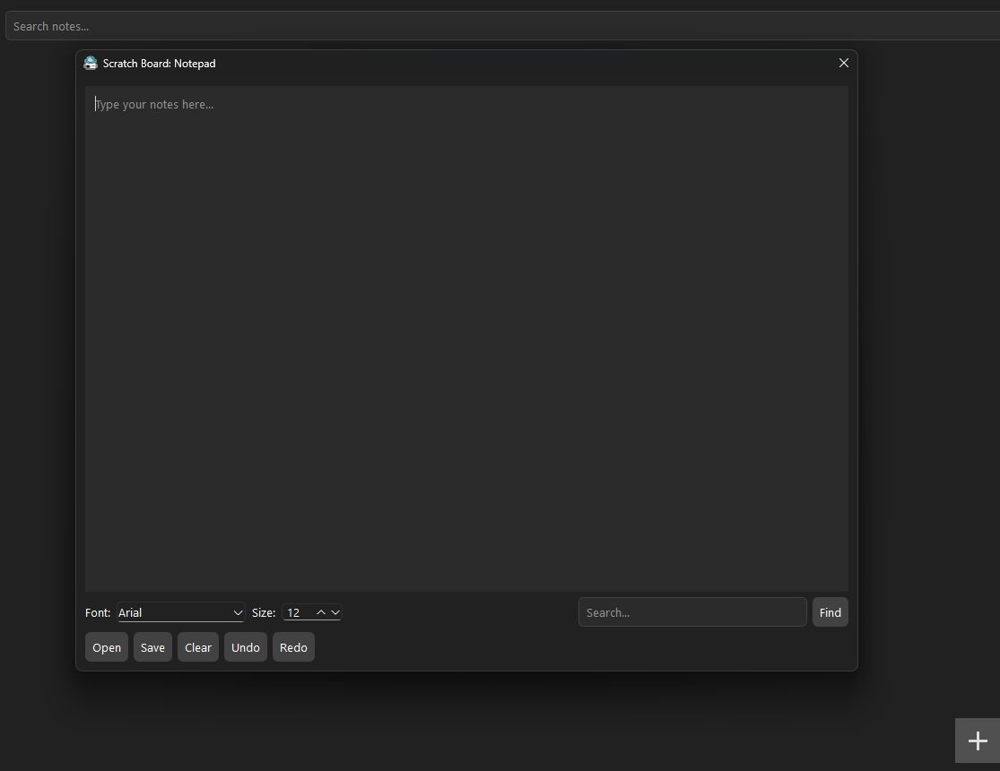
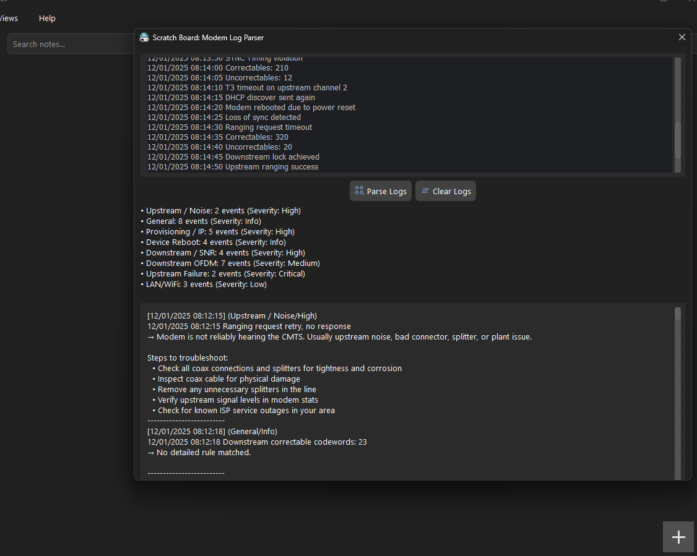
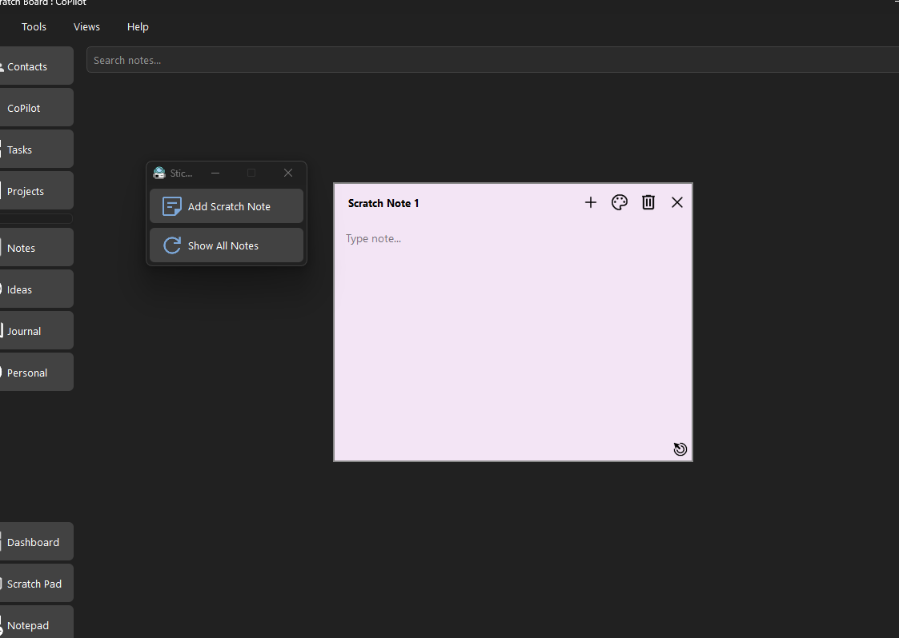
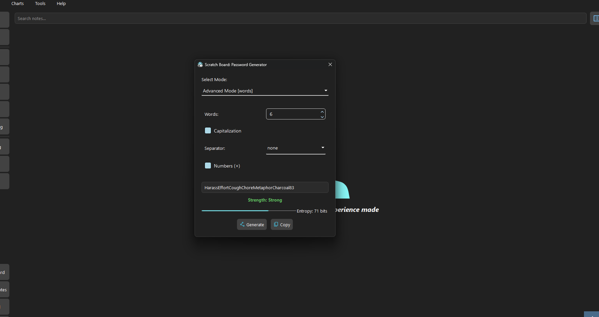

# Scratch Board

**Scratch Board** is a lightweight desktop productivity app that combines note-taking, scratch notes (sticky notes), a MAC vendor lookup, and much more. Designed for capturing quick notes and playful exploration, it keeps your ideas organized while adding a touch of fun.

---

## Features

### Main Tools
- **Scratch Notes:** Create colorful, draggable, and resizable sticky notes that auto-save.
- **Quick Links/References:** Add and delete quick links to helpful online resources.
- **Modem Log Parser:** Parse DOCSIS modem logs to troubleshoot connection issues.
- **Execute Batch Files:** Quickly select and execute a windows batch file. 
- **Notepad:** Fully integrated Notepad program similar to the Windows Notepad program. Allows saving, editing, and opening of plain-text files.
- **Mac Vendor Lookup:** Query a MAC address to find the company and country of origin from the IEEE oui database.
- **Password Generator:** Generate a helpful password with entropy.
- **Charts:** Informational charts on DOCSIS signals, fiber signals, bandwidth requirements, and much more.

### Views
- **Dashboard:** Modern dashboard that includes statistics, graphs, and helpful widgets.  
- **Sidebar Navigation:** Quickly switch between different views of the app.
- **Contacts Rolodex:** Add, edit, and delete contacts with names, emails, phone numbers, and websites.
- **Note Categories:** Includes categories such as Internet, Email, Phone, Video, Streaming, Notes, and Ideas.

### Local Database Storage
- Scratch Board uses a lightweight local SQLite database to securely store user-generated information such as scratch notes, contacts, categorized notes, and more.
- Database files are created automatically and can be exported or imported.
- The database file 'notes.db' is stored in the 'sb_data' folder within the program directory.
- Exported database files are automatically converted into a human-readable '.json' file, which allows for portability and use outside the program.

### Extras
- **Basic Markdown Text Formatting:** All notes can be formatted using MarkDown syntax, or by using toolbar buttons.
- **Image Embedding:** All notes can store images using MarkDown syntax or the button in the toolbar.
- **Keyboard Shortcuts:** All views and tools have keyboard shortcuts for quick, easy navigation.
---

## Screenshots

### Dashboard


### Notepad


### Modem Log Parser


### Scratch Notes


### Password Generator



## Installation

Clone the repository:
```bash
git clone https://github.com/Quantum-Yeti/ScratchBoard.git
```
Navigate to the project folder:
```bash
cd ScratchBoard
```
Create a Python virtual environment:
```bash
python -m venv venv
```
Activate the Python virtual environment for your platform:
```bash
# On Linux / Mac
source venv/bin/activate
```
```bash
# On Windows (PowerShell)
venv\Scripts\Activate.ps1
```
```bash
# On Windows (Command Prompt)
venv\Scripts\activate.bat
```
Install all required dependencies:
```bash
pip install -r requirements.txt
```
Run the Python program:
```bash
python main.py
```

## License

This software is provided for use for coworkers, personal viewing and evaluation only.  
Forking, redistribution, modification, and commercial use are strictly prohibited unless approved by the author.  

See the [LICENSE](LICENSE.md) file for full terms.

## Acknowledgements

This project uses the following third-party resources:

- **Google Material Icons**  
  - Provided by Google under the [Apache License 2.0](https://github.com/google/material-design-icons/blob/master/LICENSE)  
  - Website: [https://fonts.google.com/icons](https://fonts.google.com/icons)

- **PySide6 (Qt for Python)** 
  - Provides the application's GUI framework
  - Licensed under the LGPL v3.  
  - License information: https://doc.qt.io/qtforpython-6/licenses.html
