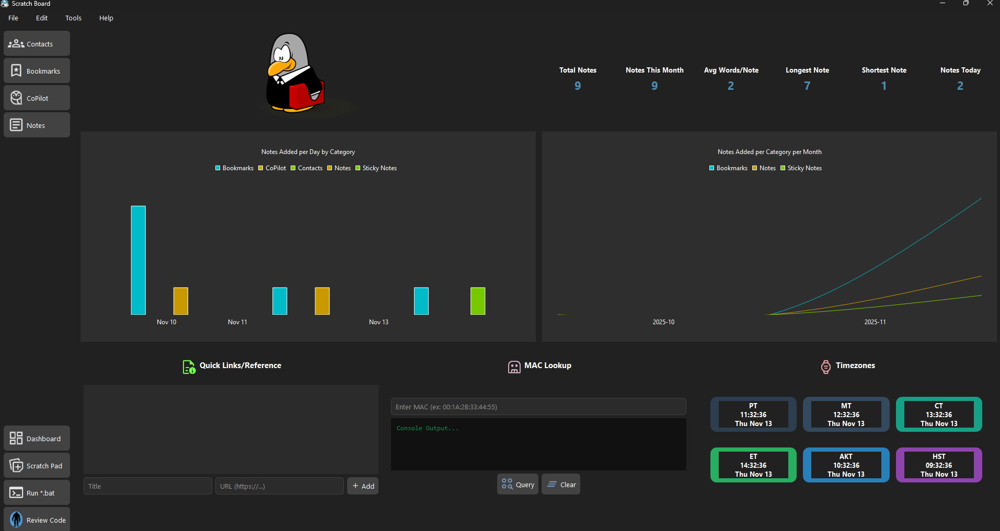

# Scratch Board

**Scratch Board** is a lightweight desktop productivity app that combines note-taking, scratch notes (sticky notes), and interactive tools such as a MAC vendor lookup. Designed for capturing quick notes and playful exploration, it keeps your ideas organized while adding a touch of fun.

---

## Features

- **Scratch Notes:** Create colorful, draggable, and resizable sticky notes with auto-save.  
- **Basic Markdown Text Formatting:** Use Markdown formatting to jot down notes and preview the html version side by side in a preview panel.  
- **Dashboard:** Modern dashboard that includes statistics, graphs, and helpful widgets.  
- **Sidebar Navigation:** Quickly switch between different views of the app.
- **Execute Batch Files:** Quickly select and execute a windows batch file.
- **Pac-Man Game:** Take a break with a built-in, playable Pac-Man game.   
- **Custom Colors:** Change the color of your scratch notes using the color picker.  
- **Mac Vendor Lookup:** Query a MAC address to find the company and country of origin.
- **Contacts Rolodex:** Add, edit, and delete contacts with names, emails, phone numbers, and websites.
- **Quick Links/References:** Add and delete quick links to helpful online resources.
- **Timezone Clocks:** View the military time for each timezone within the United States.

---
## Screenshots




## Installation

1. Clone the repository:
```bash
git clone https://github.com/Quantum-Yeti/ScratchBoard.git
```
2. Navigate to the project folder:
```bash
cd ScratchBoard
```
3. Create a Python virtual environment:
```bash
python -m venv venv
```
4. Activate the Python virtual environment for your platform:
```bash
# On Linux / Mac
source venv/bin/activate
```
```bash
# On Windows (PowerShell)
venv\Scripts\Activate.ps1
```
```bash
# On Windows (Command Prompt)
venv\Scripts\activate.bat
```
5. Install all dependencies:
```bash
pip install -r requirements.txt
```
6. Run the Python program:
```bash
python main.py
```
#### Capture and save new dependencies:
```bash
pip freeze > requirements.txt
```

## License

This software is provided for personal viewing and evaluation only.  
Forking, redistribution, modification, and commercial use are strictly prohibited unless approved by the author.  

See the [LICENSE](LICENSE.md) file for full terms.
